  

<!-- 

  

 -->

   &nbsp; 
   &nbsp; 
   

<!-- 
Social Badge:
https://img.shields.io/badge/-LinkedIn%20@SamirPaul-white?style=social&logo=Linkedin&logoColor=blue&link=https://www.linkedin.com/in/samirpaul/
https://img.shields.io/badge/-Twitter%20@ozzie5555-white?style=social&logo=twitter&logoColor=blue&link=https://www.twitter.com/ozzie5555 
-->

 
<!--  -->

<h1 style="margin-bottom: 5px;">Hi, I'm Krisna (Ozzie) 👋</h1>

<strong>Cybersecurity Enthusiast | CTF Player | Web Developer</strong>

Aktif mendalami <i>Cybersecurity</i> melalui kompetisi CTF, dengan fokus pada <b>Web Exploitation</b>, <b>Pwn</b>, dan <b>Reverse Engineering</b>. Selain keamanan siber, saya juga membangun aplikasi web menggunakan teknologi <i>modern</i>.

  
  
  
  
  
  
  
  
  

