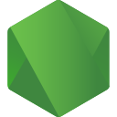

<h1>Hi, I'm Krisna (Ozzie)!</h1>

<h4>Cybersecurity, CTF, and Web Development</h4>

  
  

- 🎯 Exploring **Cybersecurity** through CTF competitions
- 🔐 Focus on **Web Exploitation**, **Cryptography**, and **Reverse Engineering**
- 💻 Building modern **web applications**
- 💬 Ask me anything on my **[issues page](https://github.com/ozzie5555/ozzie5555/issues)**

 

<table>
  <tr align="center">
    <td rowspan="5">
      
    </td>
    <td>
      
    </td>
  </tr>
  <tr align="center">
    <td>
      
    </td>
  </tr>
  <tr align="center">
    <td>
      
    </td>
  </tr>
  <tr align="center">
    <td>
      
    </td>
  </tr>
  <tr align="center">
    <td>
      
    </td>
  </tr>
</table>

 

<h2 align="left">🛠️ Favorite Tech</h2>

> Tools, languages, and other things that I like to work with.

<table>
  <tr>
    <td align="center" width="96"> Next.js</td>
    <td align="center" width="96"> Node.js</td>
    <td align="center" width="96"> React</td>
    <td align="center" width="96"> Python</td>
    <td align="center" width="96"> PHP</td>
    <td align="center" width="96"> JavaScript</td>
    <td align="center" width="96"> Flutter</td>
    <td align="center" width="96"> HTML5</td>
    <td align="center" width="96"> Supabase</td>
  </tr>
</table>

 

<h2 align="left">🎮 Contribution Graph</h2>

<picture>
  <source media="(prefers-color-scheme: dark)" srcset="https://raw.githubusercontent.com/ozzie5555/ozzie5555/output/pacman-contribution-graph-dark.svg">
  <source media="(prefers-color-scheme: light)" srcset="https://raw.githubusercontent.com/ozzie5555/ozzie5555/output/pacman-contribution-graph.svg">
  
</picture>

 

<h2 align="left">🐍 Snake</h2>

<picture>
  <source media="(prefers-color-scheme: dark)" srcset="https://raw.githubusercontent.com/ozzie5555/ozzie5555/output/github-contribution-grid-snake-dark.svg">
  <source media="(prefers-color-scheme: light)" srcset="https://raw.githubusercontent.com/ozzie5555/ozzie5555/output/github-contribution-grid-snake.svg">
  
</picture>
